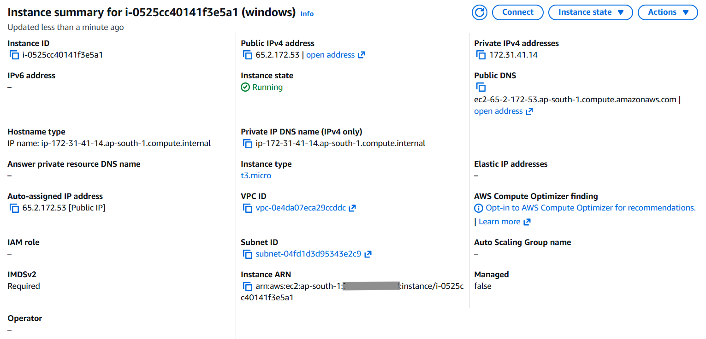
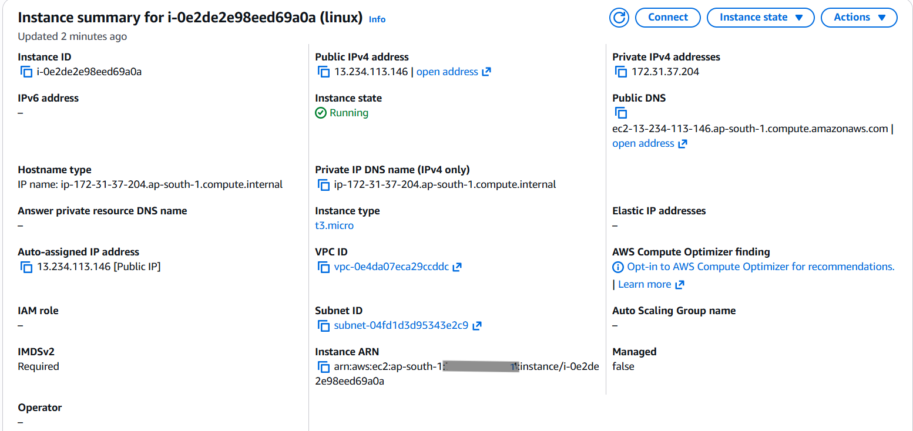
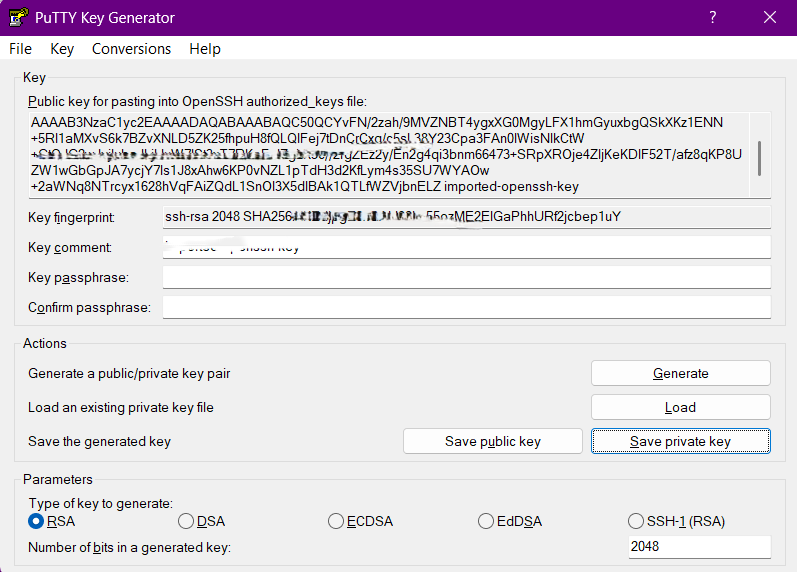
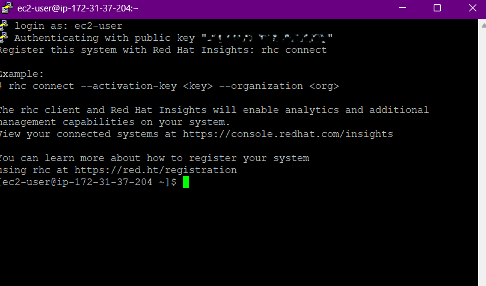
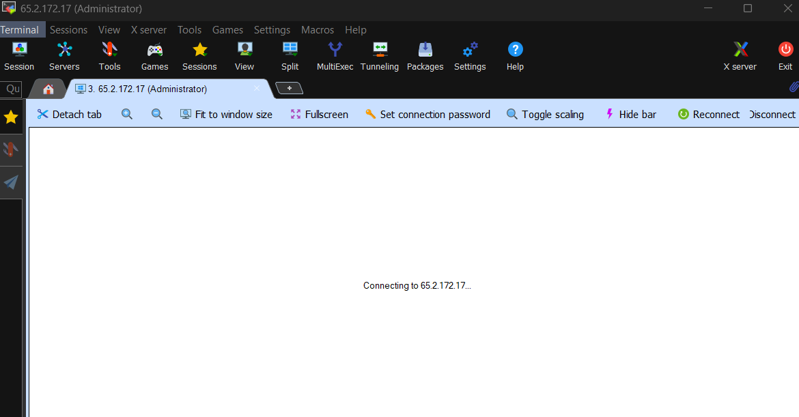
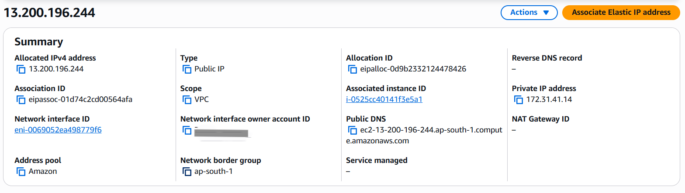

# Practical 1: EC2 Basics

## Steps Performed
1. Launched Windows Server 2022 EC2 instance:
   - Created key pair and saved securely.
   - Added RDP rule to Security Group.
   - Connected via Remote Desktop (Administrator + key pair).
2. Launched Linux RedHat EC2 instance:
   - Downloaded PuTTY and PuTTYGen.
   - Converted PEM to PPK using PuTTYGen.
   - Added SSH rule to Security Group.
   - Connected via PuTTY (public IP + PPK).
   - Connected via MobaXterm as alternative.
3. Stopped, started, and rebooted EC2 instances:
   - Observed public IP changes.
   - Verified private IP persistence.
4. Assigned Elastic IP (EIP) to instance:
   - Tested stop/start behaviour (EIP remains constant).
   - Dissociated and released EIP back to AWS.
5. Created Linux Launch Template:
   - Launched EC2 instances from template.
   - Used “Launch more like this” option.
   - Deleted template after testing.
6. Reviewed EC2 Actions menu options.
7. Configured shutdown behaviour:
   - Set to Stop/Terminate.
   - Logged into Windows EC2 and tested shutdown.
8. Terminated EC2 instances:
   - Disabled termination protection before deletion.
9. Verified EC2 dashboard:
   - All resources reset to 0 except Key Pair and Security Group.

## Key Screenshots
- 
- 
- 
- 
- 
- 
- 
- 

## Notes
- Always secure key pairs; they are required for login.
- RDP is used for Windows, SSH for Linux.
- Public IP changes on stop/start unless Elastic IP is assigned.
- Private IP remains constant within the same VPC.
- Elastic IPs must be released when not in use to avoid charges.
- Launch Templates simplify repeatable instance creation.
- Shutdown behaviour determines whether instance stops or terminates.
- Termination protection must be disabled before deleting instances.
