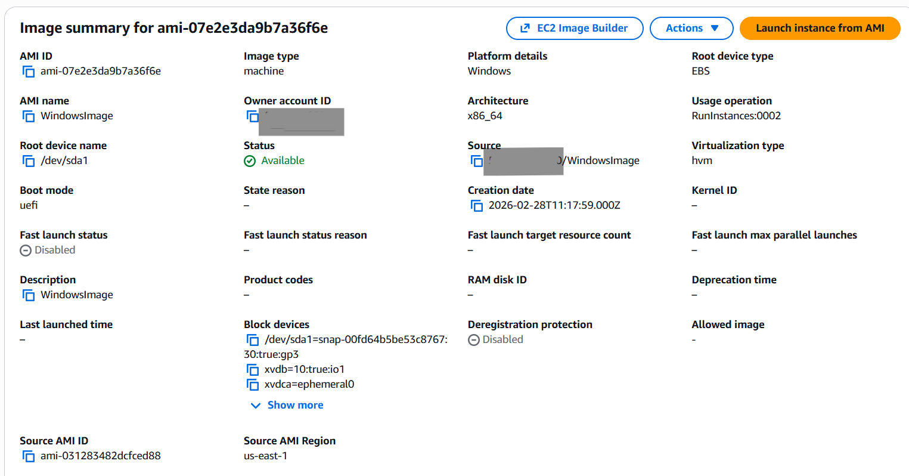
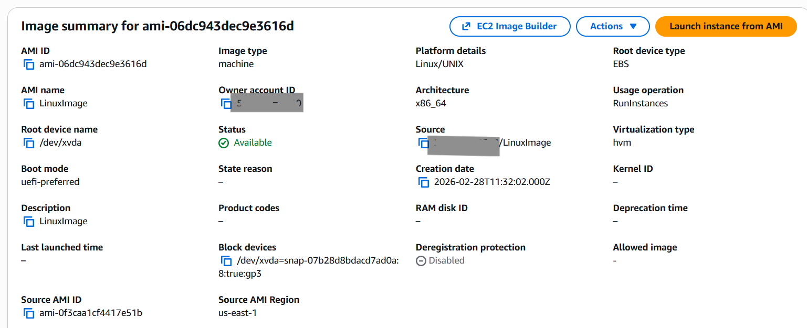
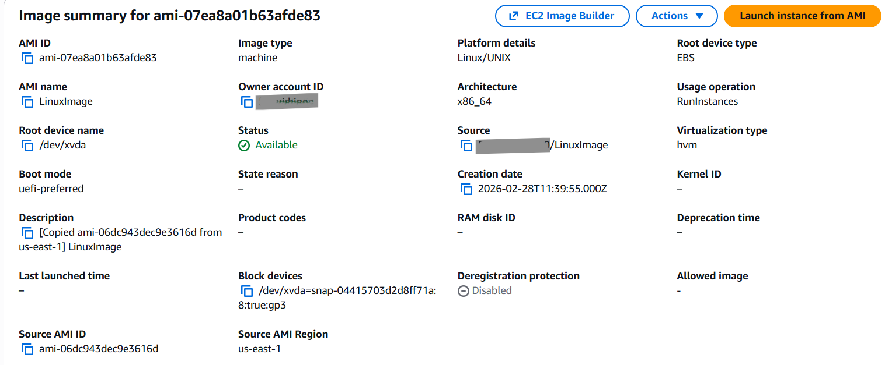
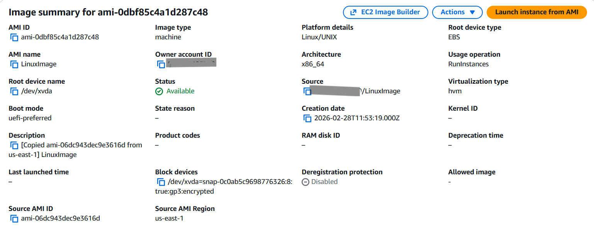
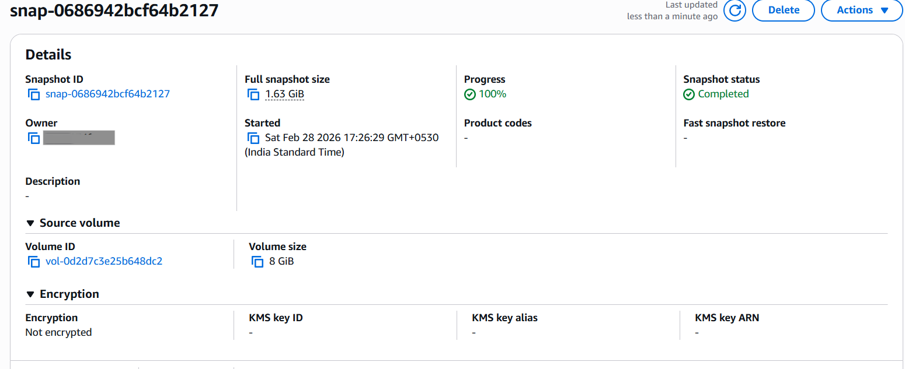
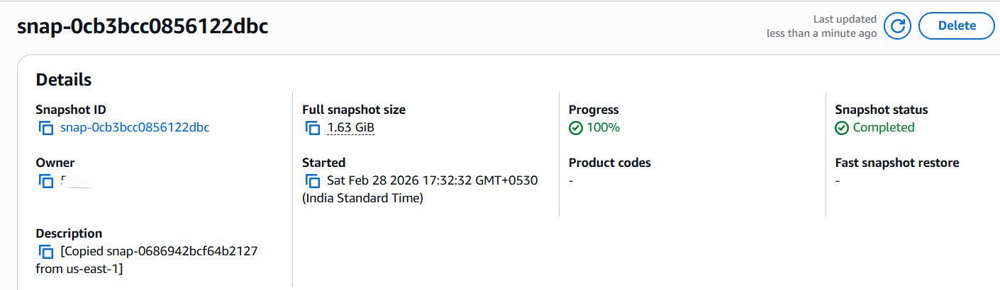
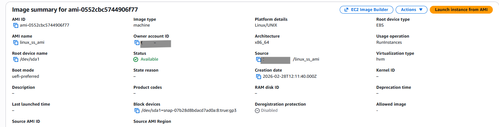
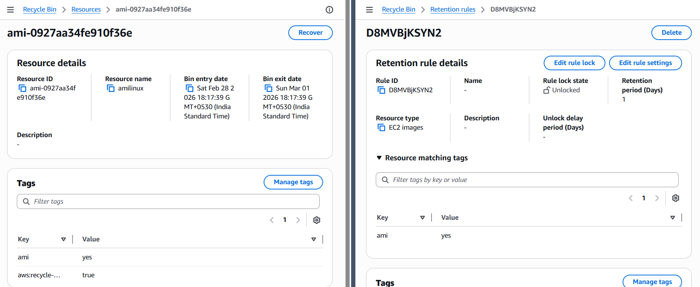

# Practical 2: EC2 Images and Snapshots

## Steps Performed
1. Launched Windows EC2 instance:
   - Logged in and created files on desktop.
   - Created an AMI image from the instance.
   - Launched new instance from the image and verified files.
2. Launched Linux EC2 instance:
   - Created AMI image from Linux instance.
   - Copied image to another region.
   - Deregistered image after verification.
3. Encrypted Linux AMI:
   - Used copy option with encryption enabled.
   - Launched EC2 instance from encrypted image and verified login.
   - Copied encrypted image within same region.
4. Snapshot operations:
   - Created snapshot from Linux instance.
   - Copied snapshot to another region and deleted after verification.
   - Encrypted snapshot and shared with another AWS account.
   - Shared image and snapshot with another account.
   - Created AMI from snapshot.
5. Recycle Bin operations:
   - Assigned tags to AMI and Snapshot.
   - Created retention rule.
   - Deleted image and snapshot, then recovered from Recycle Bin.
   - Listed all resources in Recycle Bin.
   - Deleted retention rule.
6. Terminated EC2 instances.
7. Deleted images, snapshots, and Recycle Bin rules.

## Key Screenshots
- 
- 
- 
- 
- 
- 
- 
- 
- 

## Notes
- AMIs capture the full instance state for reuse.
- Windows AMIs preserve files created before imaging.
- Public IP changes unless Elastic IP is used; AMIs preserve private IP settings.
- Copying AMIs/Snapshots across regions enables disaster recovery and migration.
- Encryption ensures data security; always verify before launch.
- Sharing AMIs/Snapshots allows cross-account collaboration.
- Recycle Bin provides recovery for deleted AMIs and Snapshots if retention rules are set.
- Always clean up unused images, snapshots, and rules to avoid charges.
