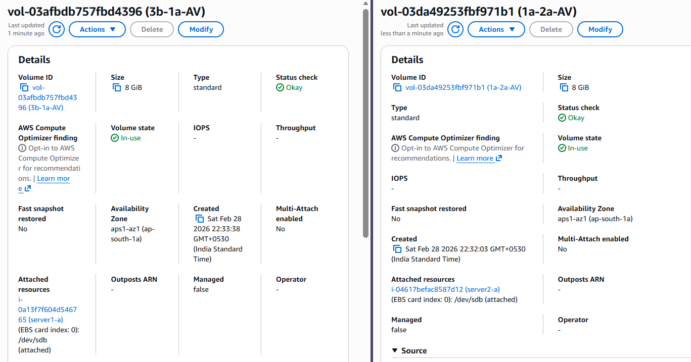
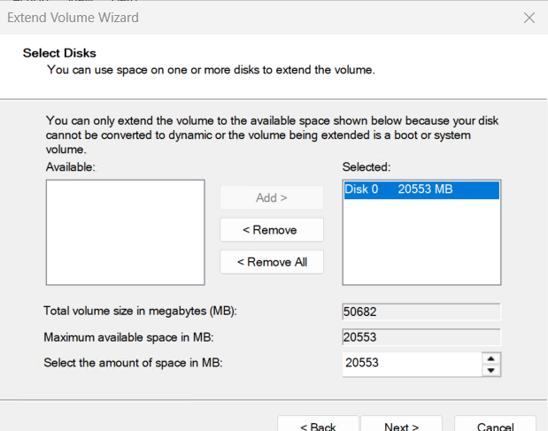
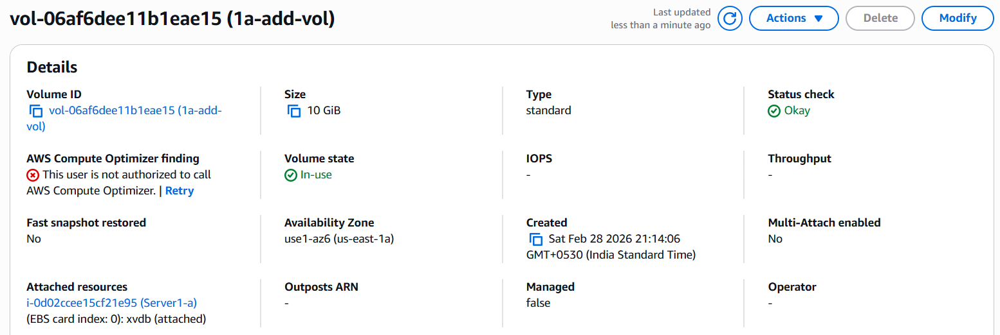
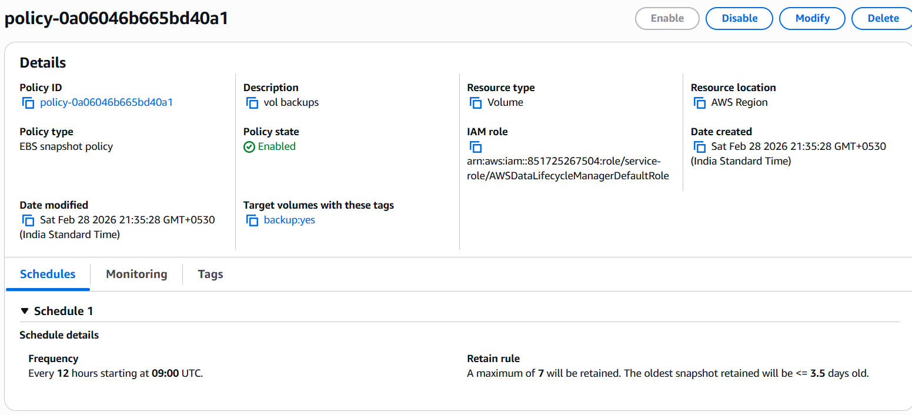
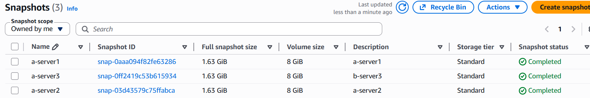

# Practical 3: EC2 Volumes and Snapshots

## Steps Performed
1. Cross Task:
   - Moved volumes across Availability Zones using snapshots.
2. Increased root volume size:
   - Expanded from 30 GB to 50 GB.
3. Added additional volume:
   - Attached 10 GB volume and made it available to the user.
4. Attach/Detach operations:
   - Detached root volume in AZ 1a and attached to another EC2 instance in same AZ as root.
   - Detached root volume in AZ 1a and attached to another EC2 instance in same AZ as additional volume.
5. Configured Life Cycle Manager:
   - Created snapshot policy with UTC time.
   - Tagged volumes properly.
   - Verified snapshots creation.
   - Deleted policy after testing.
6. Terminated EC2 instances.
7. Deleted additional volumes and Life Cycle Manager policy.

## Key Screenshots
- 
- 
- 
- 
- 
- 
- 

## Notes
- Snapshots enable moving volumes across AZs for migration and recovery.
- Root volume resizing allows scaling storage without recreating the instance.
- Additional volumes provide flexible storage expansion.
- Attach/detach operations demonstrate portability of EBS volumes within same AZ.
- Life Cycle Manager automates snapshot creation and cleanup.
- Always tag volumes and snapshots for clarity and automation.
- Clean up unused volumes, snapshots, and policies to avoid charges.
