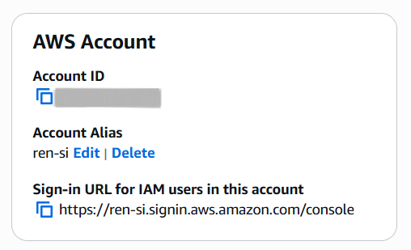
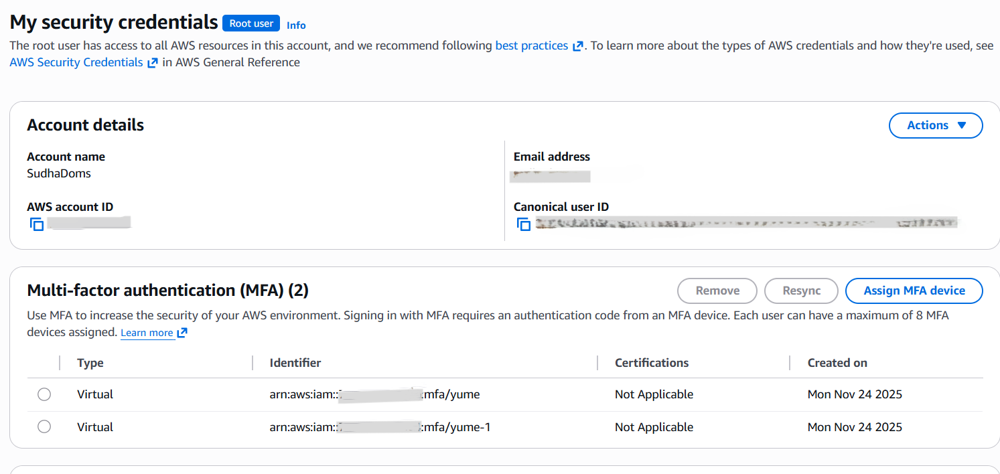
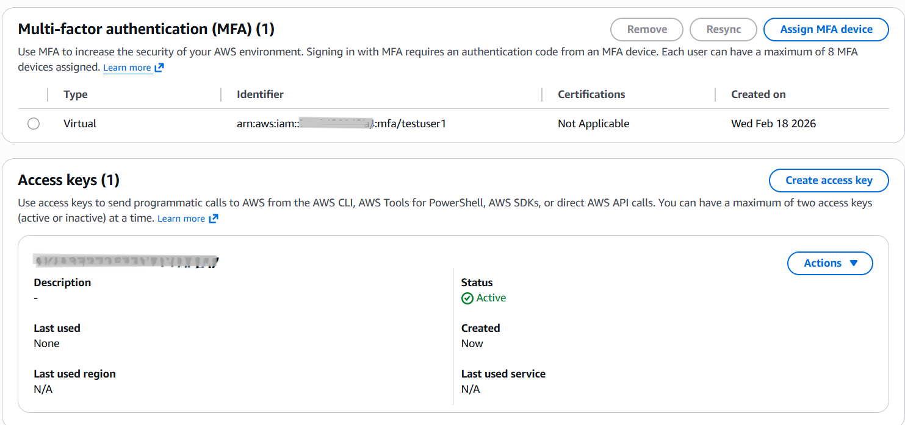
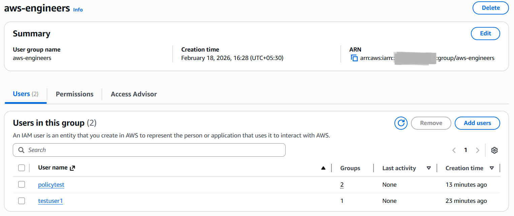

# Practical 1: IAM Basics

## Steps Performed
1. Created IAM alias and bookmarked sign-in link.
2. Created IAM user with admin policy.
3. Enabled MFA for Root and IAM user.
4. Attached/detached policies for sample user.
5. Created groups and added/removed users.
6. Tested disabling console access and reset password.
7. Created, deactivated, and deleted access keys.
8. Checked Last Accessed.
9. Deleted sample IAM users and groups.

## Key Screenshots
- 
- 
- 
- 
- 

## Notes
- Always login with IAM user (not Root).
- MFA is mandatory for both Root and IAM users.
- Policies can be attached/detached dynamically.
- Groups simplify permission management.
- Access keys should be rotated and deleted when not in use.
