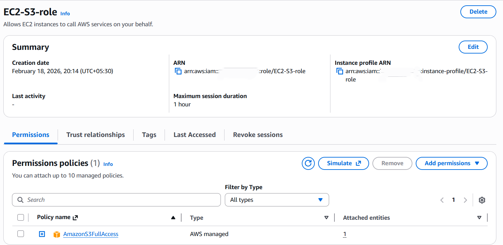
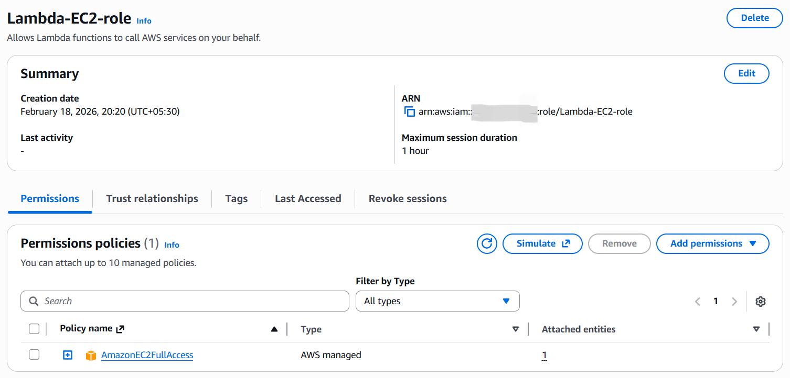
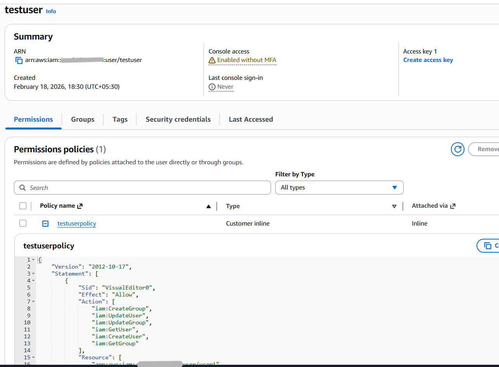

# Practical 2: IAM Roles and Policies

## Steps Performed
1. Created IAM roles for three scenarios:
   - EC2 instance role
   - Lambda execution role
   - Switch Role (cross-account)
2. Created an inline policy and attached it to IAM user (test3) with permissions to:
   - Create/List/Get users
   - Create/List/Get groups
   - Update users and groups
   - Verified permissions by logging in as test3.
3. Tested Switch Role with account ID:
   - Created IAM user in a friend’s account using Switch Role.
   - Attached IAM permissions during role creation.
4. Created IAM Access Analyzer (External and Unused).
5. Deleted the analyzer after validation.

## Key Screenshots
- 
- 
- 
- 
- 

## Notes
- Roles provide temporary credentials and are safer than long-term keys.
- Inline policies are attached directly to a single user or role.
- Custom policies allow fine-grained control over specific actions.
- Switch Role enables cross-account access with proper trust setup.
- Access Analyzer helps identify unused or external access paths.
- Always delete unused roles, policies, and analyzers to reduce risk.
